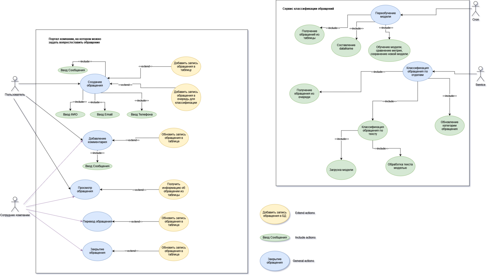
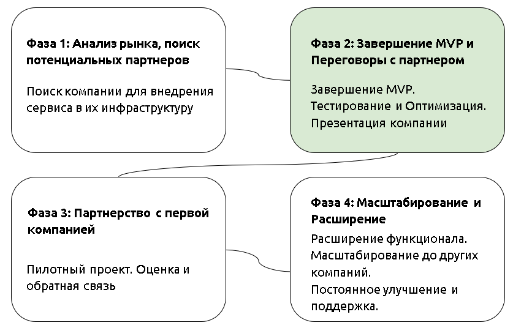
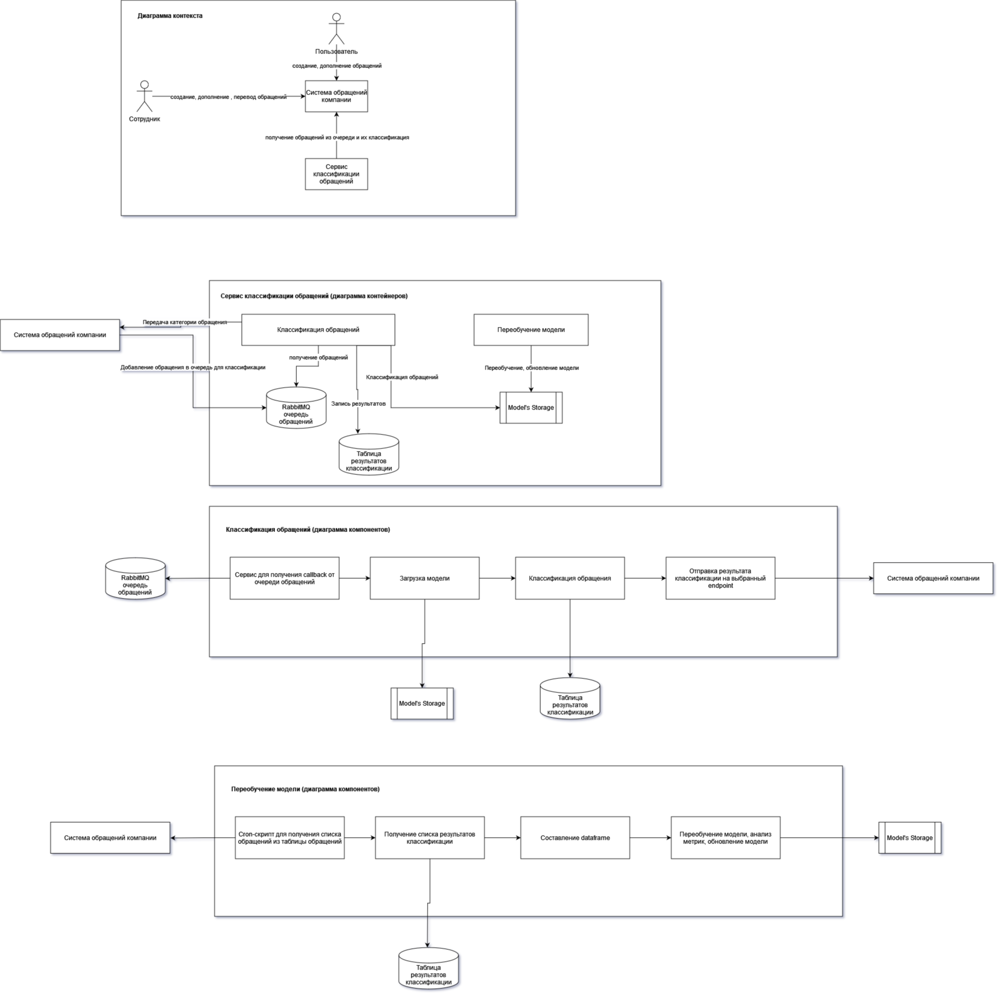

# SMART AI Assistant: Дизайн ML системы

## 1. Цели и предпосылки

### 1.1. Зачем идем в разработку продукта?

Наша цель - создать RestFull API сервис, под названием SMART AI Assistant, который будет автоматизировать работу с входящими обращениями. Он должен осуществлять автоматическую категоризацию обращений и анализировать, есть ли готовые ответы для них.

У нас есть несколько предпосылок для разработки этого продукта:

1. Во многих организациях обращения создаются на единый аккаунт, после чего уже сотрудники анализируют обращения и определяют ответственного.

2. Ручная обработка обращений требует времени и может приводить к ошибкам, недостаточной скорости ответа. SMART AI Assistant должен помочь в ускорении обработки и предоставлении точных и своевременных ответов.

3. Внедрение машинного обучения и детектирования шаблонов позволит нам автоматически определять категории обращений и рекомендовать готовые ответы, что поможет операторам быстрее и эффективнее реагировать на обращения.

### 1.2. Бизнес-требования и ограничения

- SMART AI Assistant должен быть предоставлен в виде RESTful API сервиса.
- Он должен иметь высокую точность определения категорий обращений и предоставления готовых ответов.
- Сервис должен быть разработан с учетом возможности интеграции с другими системами, такими как CRM или CMS.
- SMART AI Assistant должен быть масштабируемым, чтобы поддерживать большой объем входящих обращений.
- Система должна быть разработана с учетом безопасности и защиты данных.

### 1.3. Что входит в скоуп проекта/итерации, что не входит

В рамках этого проекта, в MVP 1.0, мы планируем реализовать следующие возможности:

- Автоматическое определение категории входящих обращений на основе текстового содержимого.
- Рекомендация готовых ответов для категорий обращений.
- Масштабируемый и производительный RESTful API сервис.
- Интеграция с другими системами по API.

Не в рамках этого проекта:

- Полная интеграция с системой CMS или CRM.
- Расширенная поддержка различных языков.
- Разработка собственной модели машинного обучения.

### 1.4. Предпосылки решения

- Для решения данной задачи мы будем использовать методы машинного обучения, такие как алгоритмы классификации текста и рекомендации на основе шаблонов.
- Мы будем использовать готовые библиотеки и фреймворки для разработки и обучения моделей.
- Данные для обучения модели будут предоставлены в соответствии с требованиями безопасности и конфиденциальности.

## 2. Методология

### 2.1. Постановка задачи

Для SMART AI Assistant мы ставим следующие задачи:

- Разработать и обучить модель машинного обучения для классификации входящих обращений на основе текстового содержимого.
- Создать модель рекомендаций для предоставления готовых ответов на основе категории обращения.
- Разработать и оптимизировать RESTful API сервис для взаимодействия с моделью.
- Провести тестирование и оценку качества модели.
- Реализовать механизм мониторинга и отслеживания производительности сервиса.

Мы будем использовать подходы машинного обучения, такие как классификация теста с использованием алгоритмов, например, на основе нейронных сетей или методов обработки естественного языка. Мы также планируем использовать предобученные модели и готовые инструменты для ускорения разработки и достижения высокой точности.

Будет проведена оценка качества модели с использованием метрик, таких как точность классификации и покрытие категорий обращений. Кроме того, мы будем собирать отзывы и обратную связь от пользователей SMART AI Assistant для постоянного улучшения модели и сервиса.

### 2.2. Блок-схема решения

#### Use-case диаграмма

Для схематического отображения сервиса была выбрана use-case диаграмма. На ней определены акторы, а также действия/функции, которые они выполняют. Для более подробного описания действия используются конструкции <<include>>, а также <<extend>> для описания последовательности действий.

### 2.3. Этапы решения задачи

Roadmap проекта представлен на изображении ниже:

Roadmap включает в себя следующие этапы:

#### Этап 1. Анализ рынка, поиск потенциальных партнеров

На этом этапе осуществляется исследование рынка с целью выявления компании, которая может внедрить наш сервис в свою инфраструктуру. Мы анализируем требования и потребности потенциальных партнеров, чтобы убедиться, что наш продукт соответствует их ожиданиям.

#### Этап 2. Завершение MVP и Переговоры с партнером

На этом этапе мы заканчиваем разработку MVP, проводим тестирование и оптимизацию, чтобы убедиться, что наш сервис работает без сбоев и соответствует требованиям пользователей.
Для MVP был выбран тестовый датасет с kaggle: https://www.kaggle.com/code/abhishek14398/automatic-ticket-classification-case-study-nlp?scriptVersionId=130903508 . В датасете представлено 21000 обезличенных обращений от клиентов банковского сектора.

Данные в датасете после предобработки имеют следующую структуру:

<table>
<tr>
<td>complaint_text</td>
<td>Текст обращения</td>
</tr>
<tr>
<td>Topic</td>
<td>ID категории обращения</td>
</tr>
</table>

Для обучения были выбраны следующие модели:

- Logistic Regression with TF-IDF encoding
- Support Vector Machines (SVM) with TF-IDF encoding
- Sequential model

Результаты обучения представлены в таблице ниже

<table>
<tr>
<td>Model</td>
<td>Accuracy</td>
</tr>
<tr>
<td>Sequential</td>
<td>0.90</td>
</tr>
<tr>
<td>Logistic Regression</td>
<td>0.98</td>
</tr>
<tr>
<td>SVM</td>
<td>0.91</td>
</tr>
</table>

Для MVP была выбрана модель Logistic Regression. Также гиперпараметры модели были оптимизированы с помощью optuna и mlflow.

После этого мы готовимся к переговорам с потенциальным партнером и представляем им наш продукт.

#### Этап 3. Партнерство с первой компанией

На этом этапе мы заключаем партнерское соглашение с первой компанией, которая согласилась внедрить наш сервис.
После заключения соглашения мы анализируем текущую it-инфрастурктуру компании, изучаем особенности для внедрения сервиса. Также запрашиваем выгрузку данных об обращениях в такой же структуре для обучения модели на данных заказчика, что будет способствовать увеличению точности классификации для конкретной компании. Мы запускаем пилотный проект, чтобы оценить эффективность нашего продукта и получить обратную связь от реальных пользователей.

#### Этап 4. Масштабирование и Расширение

На этом этапе мы расширяем функционал нашего сервиса, чтобы он соответствовал потребностям других компаний. Мы масштабируемся и начинаем предлагать наш продукт другим организациям. Постоянное улучшение и поддержка нашего сервиса становятся приоритетными задачами для нас.

# 3. Подготовка пилота

Пилот представляет собой тестирование готовой модели в реальной среде с применением мониторинга и аналитикой

## 3.1. Способ оценки пилота

Входные данные:

- Оценка достоверности полученных данных путем сравнения с другимим источниками
- Валидация данных с проверкой соответствия типа данных и их заполненности

Модель предсказания цены актива:

- Оценка метрики accuracy на пилоте

Надежность системы:

- Оценка времени доступности системы

Ресурсные затраты:

- Оценка времени для обучения модели и времени получения категории обращения
- Оценка затраченных ресурсов в виде мощностей и памяти

## 3.2. Что считаем успешным пилотом

Точность классификации:

- Точность классификации соответствует заранее согласованным в бизнес-требованиях условиям: точность классификации должна быть не менее 80%

Время инференса:

- Время тренировки модели составляет не более 1 часа

Доступность сервиса:

- Сервис доступен 99% времени

## 3.3. Подготовка пилота

Эксперимент с MVP:

CPU: 4 ядра с тактовой частотой 3 ГГц RAM: 4 ГБ Срок эксперимента: 01.12.23 - 31.12.23

Продуктовая эксплуатация: CPU: 4 ядра с тактовой частотой 3 ГГц RAM: 4 ГБ

# 4. Внедрение production системы
## 4.1. Архитектура решения

Архитектура системы для проекта классификации обращений следует подходу на основе микросервисов. Она состоит из следующих компонентов:

- API-шлюз: Действует как точка входа для входящих запросов и направляет их в соответствующий микросервис.
- Микросервис классификации обращений: Обрабатывает классификацию обращений с использованием алгоритмов машинного обучения.
- Микросервис базы данных: Хранит и извлекает классифицированные обращения из базы данных.
- Внешние системы: Точки интеграции с другими системами, такими как CRM или ERP-системы, для обмена данными.

Для схематического изображения архитектуры решения была выбрана c4-model. С ее помощью на диаграмме контекста отображено общее взаимодействие с сервисом, на диаграмме контейнеров представлены элементы архитектуры системы, а на диаграмме компонентов - последовательность работы микросервисов.

#### C4 диаграмма

## 4.2. Описание инфраструктуры и масштабируемости

Для реализации сервиса классификации обращений необходима следующая инфраструктура:

- Сервер с высокой производительностью: Для обработки большого объема обращений требуется сервер с высокопроизводительным процессором и достаточным объемом оперативной памяти.

- База данных: Для хранения данных о классифицированных обращениях будет использоваться ClickHouse база данных.

Обеспечение масштабируемости сервиса можно осуществить следующими способами:

- Асинхронная обработка: Задачи обработки обращений можно выполнять асинхронно, чтобы освободить ресурсы сервера.

- Распределение нагрузки: В случае повышенной нагрузки можно использовать несколько серверов для параллельной обработки обращений.

- Резервное копирование: Для обеспечения устойчивости и доступности данных следует регулярно создавать резервные копии базы данных.

## 4.3. Требования к работе системы

Сервис доступен для классификации обращений не более чем через 1 час с момента пуска процесса. Время тренировки модели составляет не более 1 часа. Сервис доступен 99% времени.

## 4.4. Безопасность системы

Потенциальная уязвимость системы для сервиса может быть связана с возможностью проникновения в базу данных, либо получение параметров модели. Например, есть потенциальная возможность узнать базу обращений компании. Для предотвращения такой уязвимости системы, заказчик может использовать дополнительные методы обеспечения безопасности сервиса, например, разместить сервис во внутреннем контуре компании, ограничить доступность портов, а также диапазон IP-адресов, которые могут создавать подключения к серверу.

## 4.5. Безопасность данных

Для обеспечения безопасности данных в сервисе следует определить следующие требования:

1. Аутентификация и авторизация:
   - Все запросы к сервису должны требовать аутентификации пользователя.
   - Должна быть реализована система аутентификации, такая как использование токенов доступа (Access Tokens) или JWT (JSON Web Tokens).
   - Доступ к определенным ресурсам и функциональности сервиса должен быть ограничен в зависимости от прав доступа пользователя.

2. Шифрование данных:
   - Все передаваемые данные между другими сервисами должны быть защищены с использованием протокола шифрования HTTPS.

3. Защита от атак:
   - Сервис должен быть защищен от распространенных атак, таких как SQL-инъекции, межсайтового скриптинга (XSS), межсайтовой подделки запросов (CSRF) и других уязвимостей.
   - Сервис должен применять соответствующие меры безопасности для защиты от возможных атак, включая фильтрацию и валидацию входных данных, использование параметризованных запросов и контроль доступа к базе данных.

4. Хранение и обработка данных:
   - Личные данные пользователей должны храниться с использованием методов шифрования и должны быть доступны только для авторизованных сотрудников.
   - Необходимо регулярно аудитировать доступ к данным и вести журнал всех изменений и обращений к данным.
   - При обработке данных необходимо соблюдать соответствующие нормативы и правила конфиденциальности, такие как GDPR.

5. Обновление и мониторинг:
   - Сервис должен регулярно обновляться и патчиться для исправления обнаруженных уязвимостей и проблем безопасности.
   - В последствии должны быть реализованы механизмы мониторинга для обнаружения подозрительной активности и взломов, такие как системы регистрации входящих запросов и обнаружения вторжений (IDS/IPS).

## 4.6. Издержки

Расчет месячных затрат на поддержание системы включает аренду сервера для запуска микросервисов. Затраты на лицензии на программное обеспечение отсутствуют, так как проект основан на программном обеспечении с открытым исходным кодом. Затраты на техническую поддержку и обслуживание сервера рассчитываются на основе 10% загрузки команды, состоящей из специалиста по обработке данных, инженера DevOps, а также Python программиста.

## 4.5. Integration points

Интеграция с другими системами в инфраструктуре заказчика, такими как CRM или ERP-системы, может быть рассмотрена в качестве дальнейших улучшений проекта.

## 4.6. Риски

При разработке и внедрении сервиса следует учитывать следующие риски и неопределенности:

- Риск данных: Возможность получения некорректных данных или проблем с доставкой данных.
- Риск модели: Ухудшение метрик модели из-за изменений в данных, требующие повторного обучения или переконфигурирования модели.
- Нарушение безопасности: Возможность направленной атаки на систему или злонамеренной деятельности, приводящей к утечке данных или нарушению работы сервиса.
- Проблемы производительности: При увеличении объема обрабатываемых данных система может работать медленнее, чем требуется, что повлияет на пользовательский опыт.

Для снижения этих рисков и неопределенностей систему следует тестировать с использованием различных наборов данных, а также регулярно производить мониторинг. Кроме того, важно поддерживать высокий уровень безопасности и соответствия правовым нормам, для чего необходимо сотрудничество с экспертами юридического отдела.
